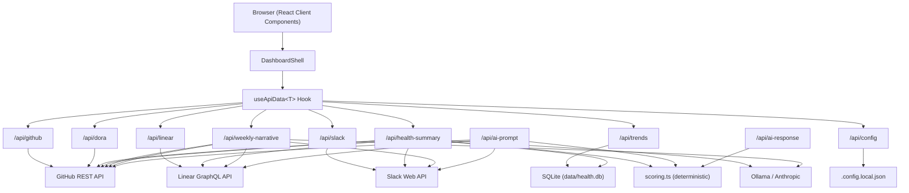
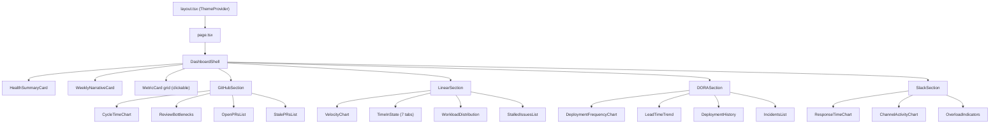

# Architecture

> Last updated: 2026-03-28. Update this document when making structural changes.

## Overview

Team Health Dashboard is a Next.js 16 application that aggregates engineering metrics from GitHub, Linear, and Slack, computes a deterministic health score, and optionally generates AI-powered narrative insights. Health score snapshots are persisted in SQLite for historical trending. Integration data is fetched on-demand from source APIs.

### Tech Stack

- **Next.js 16** (App Router) + **TypeScript** + **React 19**
- **Tailwind CSS** with class-based dark/light mode
- **Recharts 3** for charts
- **Octokit** for GitHub REST API (paginated with early termination)
- **Raw GraphQL fetch** for Linear API (no SDK)
- **@slack/web-api** for Slack API
- **Anthropic SDK**, **Ollama**, or **Manual** (any AI chat) for AI analysis
- **better-sqlite3** for health score snapshot persistence (WAL mode, file-based)

---

## System Architecture



### Request Flow

1. **Browser** renders `DashboardShell`, which mounts each section component
2. Each section calls `useApiData<T>(url, refreshKey)` to fetch its data
3. **API routes** call external APIs, compute metrics, and return structured JSON
4. **Health summary** aggregates all sources, computes a deterministic score, then passes data + score to the LLM for narrative insights
5. **Weekly narrative** sends all trend data to the LLM for a prose summary
6. Components render charts, tables, and cards from the typed response data

---

## Directory Structure

```
src/
├── app/
│   ├── page.tsx                        # Renders DashboardShell
│   ├── layout.tsx                      # Root layout, ThemeProvider
│   ├── globals.css                     # Tailwind + dark/light CSS variables
│   └── api/
│       ├── github/route.ts             # PR metrics
│       ├── linear/route.ts             # Sprint/cycle metrics
│       ├── slack/route.ts              # Communication metrics
│       ├── dora/route.ts               # DORA metrics
│       ├── health-summary/route.ts     # Score + AI insights
│       ├── weekly-narrative/route.ts   # AI prose narrative
│       ├── ai-prompt/route.ts         # Prompt export for manual AI mode
│       ├── ai-response/route.ts       # Response import for manual AI mode
│       ├── trends/route.ts             # Health score trend data (from SQLite)
│       └── config/route.ts             # Settings read/write
├── components/
│   ├── ThemeProvider.tsx                # Dark/light mode context
│   ├── dashboard/                      # Shell, health card, narrative, metric cards, settings
│   ├── github/                         # PR charts, review bottlenecks, stale/open lists
│   ├── linear/                         # Velocity, workload, time-in-state (7 tabs), stalled
│   ├── dora/                           # Deploy frequency, lead time, incidents, history
│   ├── slack/                          # Response time, channel activity, overload
│   └── ui/                             # Card, Badge, Skeleton, Spinner, ErrorState, RateLimitState, RateLimitBanner, SectionHeader
├── hooks/
│   └── useApiData.ts                   # Generic fetch hook (all sections use this)
├── lib/
│   ├── github.ts                       # Octokit wrapper, paginated PR fetching
│   ├── linear.ts                       # Linear GraphQL client
│   ├── slack.ts                        # Slack Web API wrapper
│   ├── dora.ts                         # DORA metrics: deployments, incidents, correlation
│   ├── claude.ts                       # AI provider abstraction + prompt builders
│   ├── scoring.ts                      # Deterministic health score computation
│   ├── db.ts                           # SQLite singleton (better-sqlite3, WAL mode)
│   ├── errors.ts                       # Typed errors (RateLimitError)
│   ├── config.ts                       # Dual config reader (env vars + JSON file)
│   ├── utils.ts                        # Date helpers
│   └── __tests__/                      # Vitest unit tests
└── types/
    ├── api.ts                          # ApiResponse<T> envelope (with stale flag)
    ├── trends.ts                       # TrendSnapshot, TrendsResponse types
    ├── github.ts, linear.ts, slack.ts  # Domain types
    ├── dora.ts                         # DORA types
    └── metrics.ts                      # Health score + narrative types
```

---

## Data Flow

### useApiData Hook

Every section uses the same generic hook:

```typescript
const { data, loading, refreshing, error, notConfigured, setupHint,
        fetchedAt, rateLimited, rateLimitReset, stale, revalidating, refetch } = useApiData<T>(url, refreshKey);
```

The hook returns a **standardized envelope** (`ApiResponse<T>`) that enables consistent handling across all sections:

- `notConfigured` — env vars missing, show setup placeholder
- `setupHint` — configured but unreachable (e.g., Ollama not running)
- `rateLimited` — API rate limit hit, show countdown to reset
- `refreshing` — refetching with stale data visible (no skeleton flash)
- `fetchedAt` — ISO timestamp for data freshness display

### Refresh Mechanism

```
RefreshButton (header) → increments refreshKey
  → DashboardShell passes refreshKey to all sections
    → useApiData re-fetches when refreshKey changes
```

Per-section refresh buttons also exist on GitHub, Linear, Slack, and DORA sections, allowing individual section refetches without reloading everything.

### API Response Envelope

All API routes return `ApiResponse<T>`:

```typescript
interface ApiResponse<T> {
  data?: T;
  error?: string;
  fetchedAt?: string;        // ISO timestamp
  notConfigured?: boolean;
  setupHint?: string;
  rateLimited?: boolean;
  rateLimitReset?: string;   // ISO timestamp when limit resets
  stale?: boolean;           // True when serving cached data during SWR revalidation
}
```

---

## Health Scoring System

The health score is **deterministic** — same data always produces the same score. It does not rely on the LLM.

### Algorithm

1. Start at 100
2. Each connected integration contributes deductions based on signal thresholds
3. Rescale: `score = 100 - (totalDeductions / maxPossibleDeductions) * 100`
4. Only score against connected integrations (disconnected ones don't penalize)

### Deduction Categories

| Category | Max Points | Signals |
|----------|-----------|---------|
| **GitHub** | 30 | Cycle time (8), stale PRs (8), review queue (7), cycle time trend (7) |
| **Linear** | 30 | Stalled issues (6), workload imbalance (6), velocity trend (6), flow efficiency (4), WIP per person (4), long-running items (4) |
| **Slack** | 20 | Response time (8), overloaded members (6), response time trend (6) |
| **DORA** | 20 | Deploy frequency (5), lead time (5), change failure rate (5), MTTR (5) |

### Health Bands

| Score | Band |
|-------|------|
| 80-100 | Healthy |
| 60-79 | Warning |
| 0-59 | Critical |

### Scoring File

`src/lib/scoring.ts` — exports `computeHealthScore(github, linear, slack, dora)`. Each parameter is nullable; only connected sources contribute deductions. The DORA score only activates when `totalDeployments > 0`.

---

## DORA Metrics

### Data Sources (auto-detected fallback chain)

1. **GitHub Deployments API** — checks for deployment records + statuses
2. **GitHub Releases API** — fallback if no deployments found
3. **Merged PRs to default branch** — fallback if no releases found

Can be explicitly set via `DORA_DEPLOYMENT_SOURCE` config.

### Four Key Metrics

| Metric | How It's Computed | Rating Benchmarks |
|--------|-------------------|-------------------|
| **Deployment Frequency** | Deployments per week | Elite: daily+, High: weekly, Medium: monthly, Low: <monthly |
| **Lead Time for Changes** | First commit → deploy (or PR created → merged) | Elite: <1h, High: <24h, Medium: <168h, Low: >168h |
| **Change Failure Rate** | % of deployments causing incidents | Elite: <5%, High: <10%, Medium: <15%, Low: >15% |
| **MTTR** | Avg hours from incident open → close | Elite: <1h, High: <24h, Medium: <168h, Low: >168h |

### Incident Detection

Incidents are identified from two sources:
1. **Labeled GitHub issues** — issues matching configured labels (default: `incident`, `hotfix`, `production-bug`)
2. **Reverted PRs** — merged PRs whose title starts with "Revert"

Incidents are correlated to deployments via a **24-hour time proximity window**.

### Code

`src/lib/dora.ts` — exports `fetchDORAMetrics(owner, repo, lookbackDays, options)`. Internally calls `fetchDeployments()`, `fetchReleases()`, `fetchIncidents()`, `correlateIncidents()`, `computeSummary()`, `computeTrend()`.

---

## AI Integration

### Three Providers

| Provider | Config | Notes |
|----------|--------|-------|
| **Ollama** (default) | `AI_PROVIDER=ollama` | Free, local. Requires `ollama pull llama3`. Compact prompts with defensive parsing. |
| **Anthropic** | `ANTHROPIC_API_KEY=...` | Paid. Uses Claude Sonnet. Rich prompts with detailed per-item data. |
| **Manual** | `AI_PROVIDER=manual` | No API key or local software. Export prompts to any AI chat, import responses back. |

Auto-detected: if `ANTHROPIC_API_KEY` is set, uses Anthropic. Otherwise defaults to Ollama.

### Provider-Aware Prompts

- **Compact** (Ollama): Summary-level data, JSON mode enforced, temperature 0, defensive JSON extraction
- **Rich** (Anthropic + Manual export): Individual PRs/issues with details, per-person stats, trend breakdowns, higher max tokens. Shared prompt builder code.

### AI Endpoints

1. **Health Summary** (`/api/health-summary`):
   - Computes deterministic score first (no LLM)
   - Passes score + raw data to LLM for insights and recommendations only
   - Falls back to score breakdown as insights if LLM fails
   - In manual mode: returns score + breakdown with `manualMode: true` flag

2. **Weekly Narrative** (`/api/weekly-narrative`):
   - Sends all trend data to LLM for prose summary
   - Post-processes to strip hallucinated references to disconnected sources
   - In manual mode: returns `manualMode: true` flag, UI shows export/import controls

3. **Prompt Export** (`/api/ai-prompt?type=health-summary|weekly-narrative`):
   - Generates a self-contained markdown file with instructions + all metrics data
   - Prompts instruct the AI to create a dated response file (e.g., `health-insights-2026-03-24.json`, `weekly-narrative-2026-03-24.txt`)
   - Falls back gracefully if the AI cannot create files (returns text instead)
   - Uses rich prompt format with detailed per-item data
   - After download, a "Next steps" guide appears on the card with exact instructions

4. **Response Import** (`POST /api/ai-response`):
   - Accepts `{ type, response }` — the raw text from the user's AI chat
   - For health-summary: parses JSON, validates structure, merges with current deterministic score
   - For weekly-narrative: takes prose as-is
   - Smart quote normalization (curly quotes → straight) for ChatGPT copy-paste compatibility
   - Stores result in server cache under `manual:*` keys (separate from AI-generated cache)
   - UI: import modal leads with drag-and-drop file upload zone, with paste-text fallback

### Graceful Degradation

- If AI is unconfigured → health score still works (deterministic), narrative shows setup hint
- If AI fails → health score works, error shown for narrative
- If some integrations are missing → AI only receives data from connected sources
- Manual mode always works — no external dependencies

### Code

`src/lib/claude.ts` — exports `generateHealthSummary()`, `generateWeeklyNarrative()`, `isAIConfigured()`, `getProvider()`, `buildHealthSummaryPromptFile()`, `buildWeeklyNarrativePromptFile()`. Contains provider-aware prompt builders (compact for Ollama, rich for Anthropic/Manual), JSON extraction, and hallucination stripping.

---

## Configuration System

### Dual Config with Precedence

```
process.env (via .env.local)  →  takes precedence
  ↓ fallback
.config.local.json (via Settings UI)
```

### Settings UI

Gear icon → modal with sidebar navigation (GitHub, Linear, Slack, DORA, AI sections). Each field has a `?` help popover with step-by-step instructions. Saves to `.config.local.json` (gitignored).

### Config API

- `GET /api/config` — returns which integrations are configured (booleans, no secrets)
- `POST /api/config` — saves values to `.config.local.json` (whitelisted keys only)

### Code

`src/lib/config.ts` — exports `getConfig(key)`, `saveConfig(values)`, `getConfigStatus()`, `clearConfigCache()`.

---

## Caching Layer

### Architecture

Server-side in-memory cache with stale-while-revalidate (SWR) and interface-based design for swappable backends.

- **`src/lib/cache.ts`** — `CacheStore` interface, `InMemoryCacheStore` (Map-backed), `getOrFetch<T>()` helper with SWR, `buildCacheKey()`, `getTTL(source)` for configurable TTLs
- **Pattern**: `getOrFetch(key, ttl, fetcher, { force?, rethrow? })` — returns cached value if fresh; on expiry, serves stale data immediately and fires a background revalidation; serves expired cache on error (stale-on-error)
- **Background deduplication**: `pendingBackgroundFetches` Set prevents concurrent background fetches for the same key
- **Cache keys**: deterministic, parameter-aware (e.g., `github:lookbackDays=30:staleDays=7`)

### TTLs (configurable)

Default TTLs can be overridden via `CACHE_TTL_*` env vars or Settings UI:

| Source | Default TTL | Config Key |
|--------|-------------|------------|
| GitHub | 15 min | `CACHE_TTL_GITHUB` |
| Linear | 15 min | `CACHE_TTL_LINEAR` |
| Slack | 15 min | `CACHE_TTL_SLACK` |
| DORA | 15 min | `CACHE_TTL_DORA` |
| Health Summary | 10 min | `CACHE_TTL_HEALTH_SUMMARY` |
| Weekly Narrative | 15 min | `CACHE_TTL_WEEKLY_NARRATIVE` |

### Key behaviors

- **Stale-while-revalidate**: On TTL expiry, stale data is returned immediately with `stale: true`; background fetch refreshes the cache
- **Force refresh**: Refresh button appends `?force=true`, bypassing cache
- **Stale-on-error**: Rate limit or network failure serves expired cache if available (also with `stale: true`)
- **Rate limit propagation**: `rethrow` option re-throws `RateLimitError` so API routes can serve stale data with 429 status
- **Config invalidation**: `POST /api/config` calls `cache.clear()` — new config means stale cache
- **Auto-cleanup**: Entries removed at 2x TTL to prevent memory growth
- **UI indicators**: Amber `RateLimitBanner` for rate-limited stale data; blue `RevalidatingBanner` during SWR background refresh

### Swapping backends

Implement the `CacheStore` interface (`get`, `set`, `delete`, `clear`) with a different backing store (filesystem, Redis, SQLite). Replace the singleton export in `cache.ts`.

---

## Frontend Architecture

### Component Hierarchy



### Key UI Patterns

- **Clickable metric cards** — summary cards scroll to their corresponding detail views via anchor IDs
- **Pill-style button controls** — all selectors use button groups, not native `<select>` (avoids React 19 hydration mismatches)
- **Deferred slider commits** — sliders use separate visual and committed state to avoid API calls on every drag
- **Stale-while-revalidate** — during refetch, existing data stays visible with a pulsing animation
- **Per-section refresh** — each section has its own refresh button; hidden during rate limit states
- **AbortController cleanup** — `useApiData` aborts in-flight fetches on unmount/URL change to prevent memory leaks
- **Modal focus traps** — `focus-trap-react` wraps Settings and ManualAI modals; focus cycles within the modal
- **Keyboard accessibility** — all interactive non-button elements (MetricCard, table rows, heatmap cells, file upload) respond to Enter/Space with `role="button"` and `tabIndex={0}`
- **Accessible labels** — icon-only buttons use `aria-label`; modals use `aria-labelledby` and `aria-modal="true"`

### Theme System

`ThemeProvider.tsx` — React context with `useTheme()` hook. Reads/writes `localStorage`. Defaults to dark mode. Toggles the `dark` class on `<html>`. Light mode is labeled "Incorrect Mode" in the UI. The theme toggle button uses `suppressHydrationWarning` to avoid server/client mismatch (theme is read from `localStorage` on the client).

### Security

- **SSRF protection** — `validateOllamaUrl()` in `claude.ts` rejects non-http/https schemes before any Ollama fetch
- **Input validation** — API route query params (`staleDays`, `lookbackDays`) guarded with `isNaN` + `> 0` checks
- **Null guards** — Linear client handles missing `team` in GraphQL response gracefully

---

## Testing & CI

### Tests

- **Framework**: Vitest
- **Location**: `src/lib/__tests__/`
- **Coverage**: `scoring.ts` (health score computation with mock data builders) and `utils.ts` (date helpers)
- **Run**: `npm test` (single pass) or `npm run test:watch` (continuous)

### CI Pipeline

`.github/workflows/ci.yml` — runs on push to `main` and pull requests:

1. Checkout → Setup Node 20 → `npm ci` → `npm test` → `npm run build`

---

## Rate Limit Handling

All three integration APIs have rate limit detection:

1. **GitHub** (`lib/github.ts`): Catches `RequestError` on 429 and 403 with `x-ratelimit-remaining: 0`, throws typed `RateLimitError`
2. **Linear** (`lib/linear.ts`): Checks `res.status === 429` before `!res.ok`, throws `RateLimitError`
3. **Slack** (`lib/slack.ts`): Duck-types `code === "slack_webapi_rate_limited"`, throws `RateLimitError`
4. **API routes** catch `RateLimitError`, serve stale cached data (if available) with `{ rateLimited: true, rateLimitReset, stale: true }` and 429 status
5. **useApiData** detects `rateLimited` and `stale` in response, exposes `revalidating` derived state
6. **UI**: `RateLimitBanner` (amber, inline) shows over stale data; `RateLimitState` (full-page) shows only when no cached data available; `RevalidatingBanner` (blue) shows during SWR background refresh
7. **Per-section refresh buttons** are hidden during rate limit state

### RateLimitError class

`src/lib/errors.ts` — `RateLimitError` extends `Error` with optional `retryAfter` (seconds) and `provider` (string) fields. Used by all integration libs and the cache's `rethrow` option.

---

## Persistence Layer

### SQLite (better-sqlite3)

`src/lib/db.ts` — lightweight persistence for health score snapshots.

- **Database**: `data/health.db` (gitignored via `/data/` in `.gitignore`)
- **Mode**: WAL (Write-Ahead Logging) for concurrent reads during SWR background fetches
- **Singleton**: `globalThis.__healthDb` pattern (same as cache) prevents multiple connections in dev hot-reload
- **Busy timeout**: 5000ms for lock contention

### Schema

```sql
CREATE TABLE IF NOT EXISTS health_snapshots (
  id         INTEGER PRIMARY KEY AUTOINCREMENT,
  date       TEXT    NOT NULL UNIQUE,  -- ISO date (YYYY-MM-DD), one row per day
  created_at TEXT    NOT NULL DEFAULT (datetime('now')),
  score      INTEGER NOT NULL,         -- Health score 0-100
  band       TEXT    NOT NULL,         -- 'healthy' | 'warning' | 'critical'
  deductions TEXT    NOT NULL          -- JSON array of all ScoreDeduction objects
);
```

### API

- `writeSnapshot(score, band, deductions)` — called from `/api/health-summary` on fresh (non-cached) fetches. Uses `INSERT OR REPLACE` keyed on date for one snapshot per day. Wrapped in try/catch so DB failures never break the health summary response.
- `getSnapshots(days)` — returns snapshots within the last N days, ordered by date ascending.
- `GET /api/trends?days=7|30|90` — public API that reads snapshots and returns `TrendsResponse`.

### Trend Chart

`HealthTrendChart.tsx` — Recharts `LineChart` embedded in `HealthSummaryCard`:
- Colored `ReferenceArea` health band zones (green 80-100, amber 60-79, red 0-59)
- Pill-style 7d/30d/90d period selector
- `ScoreTooltip` with per-signal deduction breakdown
- Empty state when <= 1 snapshot available

---

## Known Constraints

- GitHub PR pagination caps at 500 PRs; review data fetched for up to 50 PRs
- Recharts Tooltip `formatter` must use `(value) => [...]` without explicit parameter types (type incompatibility)
- Recharts `activeLabel` requires `String()` cast; `ResponsiveContainer` needs explicit pixel heights and `minWidth={0}`
- React hooks must be called before any conditional early returns (Rules of Hooks)
- Local LLMs (Ollama) frequently ignore prompt instructions — compensated with JSON mode, temperature 0, and post-processing
- Slack integration has not been verified with a live workspace
- Server-side in-memory cache is lost on restart (no cross-worker sharing), but SQLite snapshots persist across restarts
- SQLite stores one health score snapshot per day — sub-daily granularity is not tracked
