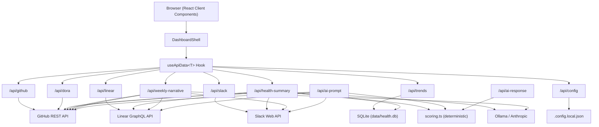

# Architecture

> Last updated: 2026-04-19. Update this document when making structural changes.

## Overview

Team Health Dashboard is a Next.js 16 application that aggregates engineering metrics from GitHub, Linear, and Slack, computes a deterministic health score, and optionally generates AI-powered narrative insights. Health score snapshots are persisted in SQLite for historical trending. GitHub and DORA integration data is fetched via `team-data-core` and stored in a shared SQLite database so other tools can read the same data.

### Tech Stack

- **Next.js 16** (App Router) + **TypeScript** + **React 19**
- **Tailwind CSS** with class-based dark/light mode
- **Recharts 3** for charts
- **team-data-core** for shared GitHub/deployment data fetching and storage
- **Raw GraphQL fetch** for Linear API (no SDK, stays in-app due to scope change detection complexity)
- **@slack/web-api** for Slack API
- **Anthropic SDK**, **Ollama**, or **Manual** (any AI chat) for AI analysis
- **better-sqlite3** for health score snapshot persistence (WAL mode, file-based)
- **Arctic** (v3) for OAuth 2.0 provider abstractions (GitHub, Linear); Slack uses manual OAuth config

---

## System Architecture



### Request Flow

1. **Browser** renders `DashboardShell`, which mounts each section component
2. Each section calls `useApiData<T>(url, refreshKey)` to fetch its data
3. **API routes** call external APIs, compute metrics, and return structured JSON
4. **Health summary** aggregates all sources, computes a deterministic score, then passes data + score to the LLM for narrative insights
5. **Weekly narrative** sends all trend data to the LLM for a prose summary
6. Components render charts, tables, and cards from the typed response data

---

## Directory Structure

```
src/
├── app/
│   ├── page.tsx                        # Renders DashboardShell
│   ├── layout.tsx                      # Root layout, ThemeProvider
│   ├── globals.css                     # Tailwind + dark/light CSS variables
│   └── api/
│       ├── github/route.ts             # PR metrics
│       ├── linear/route.ts             # Sprint/cycle metrics
│       ├── slack/route.ts              # Communication metrics
│       ├── dora/route.ts               # DORA metrics
│       ├── health-summary/route.ts     # Score + AI insights
│       ├── weekly-narrative/route.ts   # AI prose narrative
│       ├── ai-prompt/route.ts         # Prompt export for manual AI mode
│       ├── ai-response/route.ts       # Response import for manual AI mode
│       ├── trends/route.ts             # Health score trend data (from SQLite)
│       └── config/route.ts             # Settings read/write
├── components/
│   ├── ThemeProvider.tsx                # Dark/light mode context
│   ├── dashboard/                      # Shell, health card, narrative, metric cards, settings, onboarding (WelcomeHero, SetupBanner, WeightSliders)
│   ├── github/                         # PR charts, review bottlenecks, stale/open lists
│   ├── linear/                         # Velocity, workload, time-in-state (7 tabs), scope changes, stalled
│   ├── dora/                           # Deploy frequency, lead time, incidents, history
│   ├── slack/                          # Response time, channel activity, overload
│   └── ui/                             # Card, Badge, Skeleton, Spinner, ErrorState, RateLimitState, RateLimitBanner, SectionHeader
├── hooks/
│   ├── useApiData.ts                   # Generic fetch hook (all sections use this)
│   └── useConfigStatus.ts              # Config state detection (allUnconfigured, unconfiguredList)
├── lib/
│   ├── github.ts                       # Octokit wrapper, paginated PR fetching
│   ├── linear.ts                       # Linear GraphQL client
│   ├── slack.ts                        # Slack Web API wrapper
│   ├── dora.ts                         # DORA metrics: deployments, incidents, correlation
│   ├── claude.ts                       # AI provider abstraction + prompt builders
│   ├── scoring.ts                      # Deterministic health score computation (with configurable weights)
│   ├── db.ts                           # SQLite singleton (better-sqlite3, WAL mode) — health_snapshots + cycle_snapshots + oauth_tokens tables
│   ├── errors.ts                       # Typed errors (RateLimitError)
│   ├── config.ts                       # Triple-layer config reader (env > .config.local.json > OAuth DB)
│   ├── oauth-crypto.ts                 # AES-128-GCM encryption/decryption for OAuth tokens at rest
│   ├── oauth-db.ts                     # OAuth token CRUD with Linear inline refresh
│   ├── oauth-providers.ts              # Arctic GitHub/Linear provider factories + Slack manual OAuth config
│   ├── utils.ts                        # Date helpers
│   └── __tests__/                      # Vitest unit tests
└── types/
    ├── api.ts                          # ApiResponse<T> envelope (with stale flag)
    ├── trends.ts                       # TrendSnapshot, TrendsResponse types
    ├── github.ts, linear.ts, slack.ts  # Domain types
    ├── dora.ts                         # DORA types
    ├── oauth.ts                        # OAuthProvider, OAuthTokenData, OAuthTokenRow, OAuthStatus
    └── metrics.ts                      # Health score + narrative types
```

---

## Shared Data Layer

GitHub and DORA data flows through the `team-data-core` package:

```
API Route (e.g., /api/github)
  → fetchAndStorePRs(token, owner, repo)     # team-data-core: fetch from GitHub API
    → Shared SQLite DB (~/.local/share/team-data/data.db)
  → readPRs(owner, repo, { lookbackDays })   # team-data-core: query stored data
  → Metrics computation (stays in app)        # lib/github.ts: cycle time, bottlenecks, etc.
  → Return PRMetrics to client
```

**What's shared (via team-data-core):** PR fetching/storage, review fetching/storage, deployment fetching/storage with source auto-detection.

**What stays in-app:** Metrics computation (cycle time, review bottlenecks, stale PR detection), DORA metrics (frequency, CFR, MTTR), incident correlation (writes `caused_incident` back to shared DB), Linear data fetching (scope change detection is too tightly coupled), health scoring, AI prompts, caching.

**Linear exception:** Linear data fetching remains in `lib/linear.ts` because scope change detection depends on cycle history API calls and snapshot diffing that don't fit the shared fetch-store-query pattern.

The shared DB path is configurable via `TEAM_DATA_DB` env var (default: `~/.local/share/team-data/data.db`).

---

## Data Flow

### useApiData Hook

Every section uses the same generic hook:

```typescript
const { data, loading, refreshing, error, notConfigured, setupHint,
        fetchedAt, rateLimited, rateLimitReset, stale, revalidating, refetch } = useApiData<T>(url, refreshKey);
```

The hook returns a **standardized envelope** (`ApiResponse<T>`) that enables consistent handling across all sections:

- `notConfigured` — env vars missing, show setup placeholder
- `setupHint` — configured but unreachable (e.g., Ollama not running)
- `rateLimited` — API rate limit hit, show countdown to reset
- `refreshing` — refetching with stale data visible (no skeleton flash)
- `fetchedAt` — ISO timestamp for data freshness display

### Refresh Mechanism

```
RefreshButton (header) → increments refreshKey
  → DashboardShell passes refreshKey to all sections
    → useApiData re-fetches when refreshKey changes
```

Per-section refresh buttons also exist on GitHub, Linear, Slack, and DORA sections, allowing individual section refetches without reloading everything.

### API Response Envelope

All API routes return `ApiResponse<T>`:

```typescript
interface ApiResponse<T> {
  data?: T;
  error?: string;
  fetchedAt?: string;        // ISO timestamp
  notConfigured?: boolean;
  setupHint?: string;
  rateLimited?: boolean;
  rateLimitReset?: string;   // ISO timestamp when limit resets
  stale?: boolean;           // True when serving cached data during SWR revalidation
}
```

---

## Health Scoring System

The health score is **deterministic** — same data always produces the same score. It does not rely on the LLM.

### Algorithm

1. Start at 100
2. Each connected integration contributes deductions based on signal thresholds
3. Apply configurable weights: `SCORE_WEIGHT_{GITHUB,LINEAR,SLACK,DORA}` (0-100 slider values, converted to 0.0-1.0 multipliers). Weights scale both `totalDeductions` and `maxPossible` per category — raw per-signal values remain unweighted for display correctness.
4. Rescale: `score = 100 - (totalDeductions / maxPossibleDeductions) * 100`
5. Only score against connected integrations (disconnected ones don't penalize)

### Deduction Categories

| Category | Max Points | Signals |
|----------|-----------|---------|
| **GitHub** | 30 | Cycle time (8), stale PRs (8), review queue (7), cycle time trend (7) |
| **Linear** | 38 | Stalled issues (6), workload imbalance (6), velocity trend (6), flow efficiency (4), WIP per person (4), long-running items (4), scope churn (4, cycles only), scope carry-overs (4, cycles only) |
| **Slack** | 20 | Response time (8), overloaded members (6), response time trend (6) |
| **DORA** | 20 | Deploy frequency (5), lead time (5), change failure rate (5), MTTR (5) |

### Health Bands

| Score | Band |
|-------|------|
| 80-100 | Healthy |
| 60-79 | Warning |
| 0-59 | Critical |

### Scoring File

`src/lib/scoring.ts` — exports `computeHealthScore(github, linear, slack, dora, weights?)`. Each parameter is nullable; only connected sources contribute deductions. The DORA score only activates when `totalDeployments > 0`. The optional `ScoreWeights` parameter applies per-category multipliers for configurable emphasis.

---

## DORA Metrics

### Data Sources (auto-detected fallback chain)

1. **GitHub Deployments API** — checks for deployment records + statuses
2. **GitHub Releases API** — fallback if no deployments found
3. **Merged PRs to default branch** — fallback if no releases found

Can be explicitly set via `DORA_DEPLOYMENT_SOURCE` config.

### Four Key Metrics

| Metric | How It's Computed | Rating Benchmarks |
|--------|-------------------|-------------------|
| **Deployment Frequency** | Deployments per week | Elite: daily+, High: weekly, Medium: monthly, Low: <monthly |
| **Lead Time for Changes** | First commit → deploy (or PR created → merged) | Elite: <1h, High: <24h, Medium: <168h, Low: >168h |
| **Change Failure Rate** | % of deployments causing incidents | Elite: <5%, High: <10%, Medium: <15%, Low: >15% |
| **MTTR** | Avg hours from incident open → close | Elite: <1h, High: <24h, Medium: <168h, Low: >168h |

### Incident Detection

Incidents are identified from two sources:
1. **Labeled GitHub issues** — issues matching configured labels (default: `incident`, `hotfix`, `production-bug`)
2. **Reverted PRs** — merged PRs whose title starts with "Revert"

Incidents are correlated to deployments via a **24-hour time proximity window**.

### Code

`src/lib/dora.ts` — exports `fetchDORAMetrics(owner, repo, lookbackDays, options)`. Internally calls `fetchDeployments()`, `fetchReleases()`, `fetchIncidents()`, `correlateIncidents()`, `computeSummary()`, `computeTrend()`.

---

## Sprint Scope Change Tracking

### Overview

Tracks issues added and removed from Linear cycles mid-sprint, with actor attribution and timestamps. Classifies each scope change as either a **carry-over** (inherited from previous cycle within ±12h of sprint start) or a **mid-sprint change** (true scope creep). Only active in cycles mode — hidden in weekly/continuous flow mode. Controlled by the same cycle picker as other per-cycle sections (Workload, Stalled Issues, Time in State).

### Data Sources

1. **Linear IssueHistory API** — GraphQL queries on each issue's `history` for `fromCycleId`/`toCycleId` changes. Provides actor name and precise timestamp. Batched in groups of 10 via `Promise.allSettled`.
2. **SQLite cycle snapshots** — `cycle_snapshots` table stores issue ID lists per cycle on each fetch. Diff between consecutive snapshots catches changes that IssueHistory may miss. Snapshot-sourced entries show "?" for actor (no attribution available).

Changes before the cycle's `startsAt` are filtered out (sprint planning is not scope change).

### Carry-Over Classification

Each scope change is classified using two heuristics:

1. **History-based** (`source: "history"`): `isCarryOver = true` when the change is within ±12h of cycle start AND `fromCycleId === previousCycleId`
2. **Snapshot-based** (`source: "snapshot"`): `isCarryOver = true` when the change is within ±12h of cycle start (no cycle ID available from snapshots)

Removals are never carry-overs. The `ScopeChangeSummary` provides derived counts: `midSprintAdded` (excludes carry-overs), `midSprintRemoved`, and `carryOvers` (`number | null` — null for past cycles where detection wasn't performed). The `previousCycleId` is derived from the full unfiltered cycle list (not the lookback-filtered list) so carry-over detection works even when the lookback window is shorter than the sprint length.

### Persistence

`cycle_snapshots` table in `data/health.db`:

| Column | Type | Purpose |
|--------|------|---------|
| `cycle_id` | TEXT | Linear cycle ID |
| `cycle_name` | TEXT | Display name |
| `issue_ids` | TEXT | JSON array of issue IDs |
| `captured_at` | TEXT | ISO timestamp |
| `is_baseline` | INTEGER | 1 for first snapshot of a cycle |

Indexed on `(cycle_id, captured_at DESC)`. Retention: baseline + last 30 snapshots per cycle; non-baseline entries older than 90 days are purged.

### Pre-caching

All fetched cycles (including future/next sprints) get snapshots written on every Linear API fetch. This ensures removal tracking has a full baseline from day 1 of a new sprint.

### Cold-start Detection

When the earliest snapshot for a cycle postdates the cycle's `startsAt`, a warning is shown: "Tracking started mid-sprint — earlier scope changes may be missing." The `issueCountHistory` field from Linear (daily issue count array) provides gap quantification.

### UI Components

- **ScopeChangesCard** (`src/components/linear/ScopeChangesCard.tsx`) — two independently collapsible sections: "Carry-overs (N)" (collapsed by default, muted opacity styling) and "Mid-sprint changes (M)" (expanded by default, normal styling). Each section lists changes chronologically with green/red +/− indicators, Linear issue links, actor names, relative timestamps, and removal destinations. Header shows breakdown sub-line and net badge based on mid-sprint counts only. For past cycles where carry-over detection is unavailable, shows "carry-overs unknown".
- **Scope Change MetricCard** — in LinearSection summary row (5th card), shows mid-sprint net only (excluding carry-overs). Amber "scope grew" label when mid-sprint net > 0, with "(+N carried)" hint when carry-overs are detected. Scrolls to `#scope-changes`.

### Code

- `src/types/linear.ts` — `ScopeChange` (with `isCarryOver` flag), `ScopeChangeSummary` (with `midSprintAdded`, `midSprintRemoved`, `carryOvers`); `scopeChanges` and `scopeChangesByCycle` on `LinearMetrics`
- `src/lib/db.ts` — `writeCycleSnapshot()`, `getLatestCycleSnapshot()`, `getEarliestCycleSnapshot()`, `diffSnapshots()`
- `src/lib/linear.ts` — `fetchScopeChanges(currentCycle, allIssueIds, issueMap, previousCycleId)`, `fetchCycleHistoryForIssue()` (internal)

---

## AI Integration

### Three Providers

| Provider | Config | Notes |
|----------|--------|-------|
| **Ollama** (default) | `AI_PROVIDER=ollama` | Free, local. Requires `ollama pull llama3`. Compact prompts with defensive parsing. |
| **Anthropic** | `ANTHROPIC_API_KEY=...` | Paid. Uses Claude Sonnet. Rich prompts with detailed per-item data. |
| **Manual** | `AI_PROVIDER=manual` | No API key or local software. Export prompts to any AI chat, import responses back. |

Auto-detected: if `ANTHROPIC_API_KEY` is set, uses Anthropic. Otherwise defaults to Ollama.

### Provider-Aware Prompts

- **Compact** (Ollama): Summary-level data, JSON mode enforced, temperature 0, defensive JSON extraction. Includes separate scope churn (mid-sprint) and carry-over summary lines.
- **Rich** (Anthropic + Manual export): Individual PRs/issues with details, per-person stats, trend breakdowns, higher max tokens. Scope churn and carry-overs rendered as separate `### Scope Churn (Mid-Sprint)` and `### Carry-Overs (From Previous Cycle)` sections with individual issue lists. Shared prompt builder code.

### AI Endpoints

1. **Health Summary** (`/api/health-summary`):
   - Computes deterministic score first (no LLM)
   - Passes score + raw data to LLM for insights and recommendations only
   - Falls back to score breakdown as insights if LLM fails
   - In manual mode: returns score + breakdown with `manualMode: true` flag

2. **Weekly Narrative** (`/api/weekly-narrative`):
   - Sends all trend data to LLM for prose summary
   - Post-processes to strip hallucinated references to disconnected sources
   - In manual mode: returns `manualMode: true` flag, UI shows export/import controls

3. **Prompt Export** (`/api/ai-prompt?type=health-summary|weekly-narrative`):
   - Generates a self-contained markdown file with instructions + all metrics data
   - Prompts instruct the AI to create a dated response file (e.g., `health-insights-2026-03-24.json`, `weekly-narrative-2026-03-24.txt`)
   - Falls back gracefully if the AI cannot create files (returns text instead)
   - Uses rich prompt format with detailed per-item data
   - After download, a "Next steps" guide appears on the card with exact instructions

4. **Response Import** (`POST /api/ai-response`):
   - Accepts `{ type, response }` — the raw text from the user's AI chat
   - For health-summary: parses JSON, validates structure, merges with current deterministic score
   - For weekly-narrative: takes prose as-is
   - Smart quote normalization (curly quotes → straight) for ChatGPT copy-paste compatibility
   - Stores result in server cache under `manual:*` keys (separate from AI-generated cache)
   - UI: import modal leads with drag-and-drop file upload zone, with paste-text fallback

### Graceful Degradation

- If AI is unconfigured → health score still works (deterministic), narrative shows setup hint
- If AI fails → health score works, error shown for narrative
- If some integrations are missing → AI only receives data from connected sources
- Manual mode always works — no external dependencies

### Code

`src/lib/claude.ts` — exports `generateHealthSummary()`, `generateWeeklyNarrative()`, `isAIConfigured()`, `getProvider()`, `buildHealthSummaryPromptFile()`, `buildWeeklyNarrativePromptFile()`. Contains provider-aware prompt builders (compact for Ollama, rich for Anthropic/Manual), JSON extraction, and hallucination stripping.

---

## Configuration System

### Triple-Layer Config with Precedence

```
process.env (via .env.local)         →  takes precedence
  ↓ fallback
.config.local.json (via Settings UI) →  next
  ↓ fallback (OAuth-mapped keys only: GITHUB_TOKEN, LINEAR_API_KEY, SLACK_BOT_TOKEN)
oauth_tokens table (decrypted)
```

For `GITHUB_TOKEN`, `LINEAR_API_KEY`, and `SLACK_BOT_TOKEN`, `getConfigAsync()` falls through to the OAuth token DB when no env var or file-config value is set. This lets a user connect an integration via OAuth without re-entering a PAT. All API keys callers (`/api/github`, `/api/linear`, `/api/slack`, `/api/dora`, `/api/health-summary`, `/api/weekly-narrative`, `/api/ai-prompt`, `/api/ai-response`) use `getConfigAsync()` for these three keys.

### Settings UI

Gear icon → modal with sidebar navigation (GitHub, Linear, Slack, DORA, AI, Scoring sections). Each field has a `?` help popover with step-by-step instructions. Saves to `.config.local.json` (gitignored). The Scoring section contains per-integration weight sliders with live score preview, deferred commit pattern, and two-step reset confirmation.

### Config API

- `GET /api/config` — returns which integrations are configured (booleans, no secrets), plus `scoringWeights` and `cacheTtl` maps
- `POST /api/config` — saves values to `.config.local.json` (whitelisted keys only, including `SCORE_WEIGHT_*`)

### Code

`src/lib/config.ts` — exports `getConfig(key)`, `getConfigAsync(key)` (triple-layer with OAuth fallback), `saveConfig(values)`, `getConfigStatus()`, `getConfigStatusAsync()` (includes OAuth connection state per provider), `clearConfigCache()`.

---

## OAuth Authentication System

End-to-end OAuth for GitHub, Linear, and Slack. Arctic v3 handles GitHub and Linear; Slack uses a manual OAuth v2 flow because Arctic's Slack provider is OIDC-only (cannot produce bot tokens). All three providers share the same token storage, encryption, popup flow, and UI state machine.

### Flow Overview (popup model — D-04)

```
User clicks "Connect via GitHub" in SettingsModal or WelcomeHero
  → openOAuthPopup() (src/lib/oauth-client.ts)
    → synchronous window.open('/api/auth/login/github', 'oauth-popup', ...)
      → GET /api/auth/login/github (src/app/api/auth/login/github/route.ts)
        → generateState(), set {provider}_oauth_state cookie (httpOnly, 10min TTL)
        → redirect to GitHub consent URL
  → User approves on GitHub
    → GET /api/auth/callback/github (src/app/api/auth/callback/github/route.ts)
      → validate state cookie
      → Arctic: github.validateAuthorizationCode(code)
      → best-effort identity fetch: GET api.github.com/user for login name
      → saveOAuthToken('github', { accessToken, accountName, ... })
      → respond with HTML that posts { type: 'oauth-callback', provider, success, accountName }
        to window.opener and calls window.close()
  → Parent window: message listener (origin + type + provider filtered)
    → re-fetch /api/config to pick up new OAuth status
    → flip SettingsModal to "Connected as [account]" state
```

The Slack callback uses manual `fetch('https://slack.com/api/oauth.v2.access', ...)` for code exchange — same popup/postMessage envelope and token-storage path otherwise.

### Triple-Layer Config with OAuth Fallback

```
process.env (via .env.local)         →  highest precedence
  ↓ fallback
.config.local.json (via Settings UI) →  next
  ↓ fallback (only for GITHUB_TOKEN, LINEAR_API_KEY, SLACK_BOT_TOKEN)
oauth_tokens table (decrypted, with Linear inline refresh)
```

`src/lib/config.ts`:
- `getConfig(key)` — synchronous, reads env + `.config.local.json` only. Used by every non-OAuth-mapped key (ports, AI provider, cache TTLs, `SLACK_TEAM_MEMBER_IDS`, scoring weights).
- `getConfigAsync(key)` — asynchronous, adds OAuth DB as layer 3 for the three OAuth-mapped keys. Dynamic-imports `oauth-db` to avoid a circular dependency at module load.

Splitting sync and async avoids cascading async through synchronous callers like `cache.ts.getTTL()` and `claude.ts.getProvider()`. The UI precedence rule (D-09) — env var > file > OAuth — is enforced identically in both the runtime fallback and the Settings UI state machine.

### Token Storage

`oauth_tokens` table in `data/health.db` (Plan 02 persistence DB — not the shared `team-data-core` DB):

| Column                        | Type                    | Purpose                                                                          |
| ----------------------------- | ----------------------- | -------------------------------------------------------------------------------- |
| `id`                          | INTEGER PK              | Row ID                                                                           |
| `provider`                    | TEXT UNIQUE             | `github` \| `linear` \| `slack` (one row per provider)                           |
| `access_token`                | TEXT                    | AES-128-GCM ciphertext, base64 (IV + auth tag + ciphertext concatenated)         |
| `refresh_token`               | TEXT NULL               | Encrypted (Linear only; GitHub and Slack bot tokens don't expire)                |
| `expires_at`                  | TEXT NULL               | ISO timestamp for Linear access tokens (24h lifetime)                            |
| `account_name`                | TEXT NULL               | Best-effort display name from provider profile (GitHub login, Linear viewer name, Slack team name) |
| `created_at` / `updated_at`   | TEXT                    | ISO timestamps (default `datetime('now')`)                                       |

### Token Encryption at Rest

`src/lib/oauth-crypto.ts` — AES-128-GCM via Node.js built-in `crypto`. Key derived from `OAUTH_ENCRYPTION_KEY` via SHA-256 and sliced to 16 bytes. Each encryption call uses a fresh 16-byte IV. Output layout: `iv (16) || authTag (16) || ciphertext`, base64-encoded. Missing `OAUTH_ENCRYPTION_KEY` throws a clear error — never silently stores tokens unencrypted.

Oslo was originally considered (per CLAUDE.md) but is deprecated; built-in `crypto` requires zero third-party dependencies and uses the same algorithm.

### Provider Factories

`src/lib/oauth-providers.ts`:
- **GitHub** — `getGitHubProvider()` returns an Arctic `GitHub` instance. Scopes: `repo read:org`. The `repo` scope grants write access (GitHub OAuth has no read-only repo scope); this is disclosed in the Settings UI help text.
- **Linear** — `getLinearProvider()` returns an Arctic `Linear` instance. Scope: `read`. Returns refresh tokens (apps created after Oct 2025 have this by default).
- **Slack** — `SLACK_OAUTH_CONFIG` exposes `authorizeUrl`, `tokenUrl`, and `getRedirectUri()` for the manual v2 flow. Bot scopes: `channels:read channels:history users:read`.

All factory functions lazily read env vars — absent credentials don't crash module load; they only fail when a connect attempt starts.

### Linear Token Refresh (on-demand, D-07)

`src/lib/oauth-db.ts`:
- `saveOAuthToken(provider, tokenData)` — upserts encrypted row (INSERT OR REPLACE by `provider`)
- `getOAuthToken(provider)` — returns decrypted access token or null. For Linear, checks `expires_at` and, if within 5 minutes of expiry, calls `https://api.linear.app/oauth/token` with `grant_type=refresh_token` and rotates both access and refresh tokens atomically (Linear invalidates old refresh tokens on each use — failure to rotate causes `invalid_grant` on the next refresh).
- If the refresh fails (revoked, network error), the row is deleted (D-08) and null is returned — the caller falls back to env var / file config, or the UI shows the amber "Connection lost" banner with a Reconnect button.
- `deleteOAuthToken(provider)` — exposed via `POST /api/config { action: "disconnect", provider }` for the Settings UI disconnect flow.
- `getOAuthStatus()` — returns connection state + `accountName` per provider for the Settings UI.

All DB operations are wrapped in try/catch; DB failures never crash the request path.

### OAuth API Routes

| Route                                     | Purpose                                                                                             |
| ----------------------------------------- | --------------------------------------------------------------------------------------------------- |
| `GET /api/auth/login/github`              | generate state cookie, redirect to GitHub consent (scopes `repo read:org`)                          |
| `GET /api/auth/login/linear`              | generate state cookie, redirect to Linear consent (scope `read`)                                    |
| `GET /api/auth/login/slack`               | generate state cookie, redirect to Slack OAuth v2 (bot scopes)                                      |
| `GET /api/auth/callback/github`           | validate state, Arctic code exchange, fetch /user, save encrypted token                             |
| `GET /api/auth/callback/linear`           | validate state, Arctic code exchange, fetch viewer via GraphQL, save encrypted access+refresh+expires_at |
| `GET /api/auth/callback/slack`            | validate state, manual fetch to `oauth.v2.access`, save encrypted bot token                         |
| `/auth/callback/[provider]` (page)        | client-side fallback landing page for the rare case where the popup lands on a page URL            |

All callback responses return HTML that `postMessage`s `{ type: 'oauth-callback', provider, success, accountName?, reason? }` to `window.opener` with `window.location.origin` as the target, then auto-closes the popup. No `Cross-Origin-Opener-Policy` header is set (COOP nullifies `window.opener` — research Pitfall 6).

### Settings UI State Machine

`src/components/dashboard/SettingsModal.tsx` renders one of four states per provider via the shared `OAuthSectionForm` subcomponent (eliminates triplicate JSX for GitHub / Linear / Slack):

1. **Env precedence active** — env or file has a token → manual form is shown, OAuth UI suppressed (D-09)
2. **OAuth connected** — green badge with `accountName`, inline `Confirm disconnect` / `Keep connected` buttons
3. **OAuth disconnected-reconnect** — amber "Connection lost" banner + Reconnect button. Triggered by `prevOAuthRef` transition tracking: when a provider flips from `connected=true` to `connected=false` during a config status refetch, the banner appears. Explicit user-initiated disconnects reset `prevOAuthRef` so they do not show this banner.
4. **Not configured** — "Connect via {Provider} OAuth" button + "or use API key instead" escape hatch

`src/components/dashboard/WelcomeHero.tsx` (D-06) uses the same `openOAuthPopup` helper for unconnected integrations — onboarding defaults to OAuth with a small "or use API key" fallback link.

### Popup Client Helper

`src/lib/oauth-client.ts` — `openOAuthPopup(provider, onSuccess, onError)`:
- Synchronous `window.open()` inside the click handler (research Pitfall 5 — async `window.open()` is blocked by browsers as a programmatic popup)
- Message listener filtered by `event.origin === window.location.origin`, `event.data?.type === 'oauth-callback'`, and `event.data?.provider === provider` — avoids cross-talk with other `postMessage` traffic
- 500ms popup-closed poll removes the listener if the user dismisses the popup without completing OAuth

### Slack Team Member Filtering (D-12)

`src/lib/slack.ts` reads `SLACK_TEAM_MEMBER_IDS` via sync `getConfig()` (not OAuth-mapped, so no async needed). Splits on both `,` and `\n` so the Settings UI textarea accepts either format. When the filter is non-empty, the `userMap` population skips users whose IDs are not in the list — every downstream metric (response times, overload indicators, channel activity) automatically scopes to the roster.

`src/types/slack.ts` requires a `teamMemberFilter: number | null` on `SlackMetrics` — the `null` sentinel ("no filter active") is unambiguous in the SlackSection header conditional, and the required field forces tests to supply a value.

### Smoke Tests (D-10)

`src/lib/slack.test.ts` uses `describe.skipIf(!process.env.SLACK_BOT_TOKEN || !CHANNEL_IDS?.length)` — tests only run when live Slack credentials are present. They validate the `SlackMetrics` shape, channel activity structure, overload indicator fields, and `teamMemberFilter` sentinel. See [docs/slack-setup.md](docs/slack-setup.md) for Slack app creation, scope configuration, bot installation, and channel ID discovery.

---

## Caching Layer

### Architecture

Server-side in-memory cache with stale-while-revalidate (SWR) and interface-based design for swappable backends.

- **`src/lib/cache.ts`** — `CacheStore` interface, `InMemoryCacheStore` (Map-backed), `getOrFetch<T>()` helper with SWR, `buildCacheKey()`, `getTTL(source)` for configurable TTLs
- **Pattern**: `getOrFetch(key, ttl, fetcher, { force?, rethrow? })` — returns cached value if fresh; on expiry, serves stale data immediately and fires a background revalidation; serves expired cache on error (stale-on-error)
- **Background deduplication**: `pendingBackgroundFetches` Set prevents concurrent background fetches for the same key
- **Cache keys**: deterministic, parameter-aware (e.g., `github:lookbackDays=30:staleDays=7`)

### TTLs (configurable)

Default TTLs can be overridden via `CACHE_TTL_*` env vars or Settings UI:

| Source | Default TTL | Config Key |
|--------|-------------|------------|
| GitHub | 15 min | `CACHE_TTL_GITHUB` |
| Linear | 15 min | `CACHE_TTL_LINEAR` |
| Slack | 15 min | `CACHE_TTL_SLACK` |
| DORA | 15 min | `CACHE_TTL_DORA` |
| Health Summary | 10 min | `CACHE_TTL_HEALTH_SUMMARY` |
| Weekly Narrative | 15 min | `CACHE_TTL_WEEKLY_NARRATIVE` |

### Key behaviors

- **Stale-while-revalidate**: On TTL expiry, stale data is returned immediately with `stale: true`; background fetch refreshes the cache
- **Force refresh**: Refresh button appends `?force=true`, bypassing cache
- **Stale-on-error**: Rate limit or network failure serves expired cache if available (also with `stale: true`)
- **Rate limit propagation**: `rethrow` option re-throws `RateLimitError` so API routes can serve stale data with 429 status
- **Config invalidation**: `POST /api/config` calls `cache.clear()` — new config means stale cache
- **Auto-cleanup**: Entries removed at 2x TTL to prevent memory growth
- **UI indicators**: Amber `RateLimitBanner` for rate-limited stale data; blue `RevalidatingBanner` during SWR background refresh

### Swapping backends

Implement the `CacheStore` interface (`get`, `set`, `delete`, `clear`) with a different backing store (filesystem, Redis, SQLite). Replace the singleton export in `cache.ts`.

---

## Frontend Architecture

### Component Hierarchy

```mermaid
graph TD
    Layout["layout.tsx (ThemeProvider)"]
    Page["page.tsx"]
    Shell["DashboardShell"]

    Layout --> Page --> Shell

    Shell --> ConfigHook["useConfigStatus"]
    Shell --> WelcomeHero["WelcomeHero (all unconfigured)"]
    Shell --> SetupBanner["SetupBanner (partially configured)"]
    Shell --> Health["HealthSummaryCard"]
    Shell --> Narrative["WeeklyNarrativeCard"]
    Shell --> MetricCards["MetricCard grid (clickable)"]
    Shell --> GH["GitHubSection"]
    Shell --> LN["LinearSection"]
    Shell --> DORA["DORASection"]
    Shell --> SL["SlackSection"]
    Shell --> Settings["SettingsModal (with WeightSliders)"]

    GH --> CycleChart["CycleTimeChart"]
    GH --> ReviewBot["ReviewBottlenecks"]
    GH --> OpenPRs["OpenPRsList"]
    GH --> StalePRs["StalePRsList"]

    LN --> Velocity["VelocityChart"]
    LN --> TimeState["TimeInState (7 tabs)"]
    LN --> ScopeCard["ScopeChangesCard (cycles only)"]
    LN --> Workload["WorkloadDistribution"]
    LN --> Stalled["StalledIssuesList"]

    DORA --> DeployFreq["DeploymentFrequencyChart"]
    DORA --> LeadTime["LeadTimeTrend"]
    DORA --> DeployHist["DeploymentHistory"]
    DORA --> Incidents["IncidentsList"]

    SL --> RespTime["ResponseTimeChart"]
    SL --> ChanAct["ChannelActivityChart"]
    SL --> Overload["OverloadIndicators"]
```



### Key UI Patterns

- **Clickable metric cards** — summary cards scroll to their corresponding detail views via anchor IDs
- **Pill-style button controls** — all selectors use button groups, not native `<select>` (avoids React 19 hydration mismatches)
- **Deferred slider commits** — sliders use separate visual and committed state to avoid API calls on every drag
- **Stale-while-revalidate** — during refetch, existing data stays visible with a pulsing animation
- **Per-section refresh** — each section has its own refresh button; hidden during rate limit states
- **AbortController cleanup** — `useApiData` aborts in-flight fetches on unmount/URL change to prevent memory leaks
- **Modal focus traps** — `@radix-ui/react-dialog` wraps Settings and ManualAI modals; provides focus trapping, ARIA roles, and keyboard dismissal
- **Keyboard accessibility** — all interactive non-button elements (MetricCard, table rows, heatmap cells, file upload) respond to Enter/Space with `role="button"` and `tabIndex={0}`
- **Accessible labels** — icon-only buttons use `aria-label`; modals use `aria-labelledby` and `aria-modal="true"`

### Onboarding Flow

`DashboardShell` uses the `useConfigStatus` hook to detect the config state and render one of three experiences:

1. **Loading** — skeleton placeholder while `/api/config` is fetched
2. **All unconfigured** (`allUnconfigured === true`) — `WelcomeHero` card with per-integration "Connect" buttons. Each button opens `SettingsModal` pre-navigated to that integration's section via the `initialSection` prop. Data sections and weekly narrative are hidden in this state.
3. **Partially/fully configured** — normal dashboard with an optional `SetupBanner` (`role="status"`, `aria-live="polite"`) listing unconfigured integrations. "Connect now" navigates to the first unconfigured section. The banner is dismissible (persisted to `localStorage`).

### Empty States

Each section component handles two empty states:

- **Treatment A (not configured)**: `notConfigured` from `useApiData` triggers a centered card with section icon, heading, body copy, and "Connect" button calling `onOpenSettings(section)`.
- **Treatment B (configured, no data)**: Section header and controls remain visible; a contextual message appears in the chart area (e.g., "No pull requests merged in the last X days. Try a longer lookback period.").

### Score Breakdown Interactivity

The `HealthSummaryCard` score breakdown panel:
- **Non-zero deduction rows**: clickable (`role="button"`, `cursor-pointer`), with "↗" suffix. Clicking/pressing Enter scrolls to the corresponding section via `id` attributes (`github-section`, `linear-section`, `slack-section`, `dora-section`).
- **Zero-deduction rows**: dimmed (`opacity-50`), not interactive.
- **`onDeductionsLoaded` callback**: passes `ScoreDeduction[]` to `DashboardShell`, which forwards them to `WeightSliders` for live score preview.

### Theme System

`ThemeProvider.tsx` — React context with `useTheme()` hook. Reads/writes `localStorage`. Defaults to dark mode. Toggles the `dark` class on `<html>`. Light mode is labeled "Incorrect Mode" in the UI. The theme toggle button uses `suppressHydrationWarning` to avoid server/client mismatch (theme is read from `localStorage` on the client).

### Security

- **SSRF protection** — `validateOllamaUrl()` in `claude.ts` rejects non-http/https schemes before any Ollama fetch
- **Input validation** — API route query params (`staleDays`, `lookbackDays`) guarded with `isNaN` + `> 0` checks
- **Null guards** — Linear client handles missing `team` in GraphQL response gracefully

---

## Testing & CI

### Tests

- **Framework**: Vitest
- **Location**: `src/lib/__tests__/`
- **Coverage**: `scoring.ts` (health score computation with mock data builders), `utils.ts` (date helpers), `empty-states.ts` (Treatment B condition logic for all four sections), `cache-ttl.ts`, `db.ts`, `manual-ai.ts`
- **Run**: `npm test` (single pass) or `npm run test:watch` (continuous)

### CI Pipeline

`.github/workflows/ci.yml` — runs on push to `main` and pull requests:

1. Checkout → Setup Node 20 → `npm ci` → `npm test` → `npm run build`

---

## Rate Limit Handling

All three integration APIs have rate limit detection:

1. **GitHub** (`lib/github.ts`): Catches `RequestError` on 429 and 403 with `x-ratelimit-remaining: 0`, throws typed `RateLimitError`
2. **Linear** (`lib/linear.ts`): Checks `res.status === 429` before `!res.ok`, throws `RateLimitError`
3. **Slack** (`lib/slack.ts`): Duck-types `code === "slack_webapi_rate_limited"`, throws `RateLimitError`
4. **API routes** catch `RateLimitError`, serve stale cached data (if available) with `{ rateLimited: true, rateLimitReset, stale: true }` and 429 status
5. **useApiData** detects `rateLimited` and `stale` in response, exposes `revalidating` derived state
6. **UI**: `RateLimitBanner` (amber, inline) shows over stale data; `RateLimitState` (full-page) shows only when no cached data available; `RevalidatingBanner` (blue) shows during SWR background refresh
7. **Per-section refresh buttons** are hidden during rate limit state

### RateLimitError class

`src/lib/errors.ts` — `RateLimitError` extends `Error` with optional `retryAfter` (seconds) and `provider` (string) fields. Used by all integration libs and the cache's `rethrow` option.

---

## Persistence Layer

### SQLite (better-sqlite3)

`src/lib/db.ts` — lightweight persistence for health score snapshots.

- **Database**: `data/health.db` (gitignored via `/data/` in `.gitignore`)
- **Mode**: WAL (Write-Ahead Logging) for concurrent reads during SWR background fetches
- **Singleton**: `globalThis.__db` pattern (same as cache's `__apiCache`) prevents multiple connections in dev hot-reload
- **Busy timeout**: 5000ms for lock contention

### Schema

```sql
CREATE TABLE IF NOT EXISTS health_snapshots (
  id         INTEGER PRIMARY KEY AUTOINCREMENT,
  date       TEXT    NOT NULL UNIQUE,  -- ISO date (YYYY-MM-DD), one row per day
  created_at TEXT    NOT NULL DEFAULT (datetime('now')),
  score      INTEGER NOT NULL,         -- Health score 0-100
  band       TEXT    NOT NULL,         -- 'healthy' | 'warning' | 'critical'
  deductions TEXT    NOT NULL          -- JSON array of all ScoreDeduction objects
);
```

### API

- `writeSnapshot(score, band, deductions)` — called from `/api/health-summary` on fresh (non-cached) fetches. Uses `INSERT OR REPLACE` keyed on date for one snapshot per day. Wrapped in try/catch so DB failures never break the health summary response.
- `getSnapshots(days)` — returns snapshots within the last N days, ordered by date ascending.
- `GET /api/trends?days=7|30|90` — public API that reads snapshots and returns `TrendsResponse`.

### Trend Chart

`HealthTrendChart.tsx` — Recharts `LineChart` embedded in `HealthSummaryCard`:
- Colored `ReferenceArea` health band zones (green 80-100, amber 60-79, red 0-59)
- Pill-style 7d/30d/90d period selector
- `ScoreTooltip` with per-signal deduction breakdown
- Empty state when <= 1 snapshot available

---

## Known Constraints

- GitHub PR pagination caps at 500 PRs; review data fetched for up to 50 PRs
- Recharts Tooltip `formatter` must use `(value) => [...]` without explicit parameter types (type incompatibility)
- Recharts `activeLabel` requires `String()` cast; `ResponsiveContainer` needs explicit pixel heights and `minWidth={0}`
- React hooks must be called before any conditional early returns (Rules of Hooks)
- Local LLMs (Ollama) frequently ignore prompt instructions — compensated with JSON mode, temperature 0, and post-processing
- Slack integration code paths are complete with smoke tests (`src/lib/slack.test.ts`); end-to-end confirmation against a live workspace is deferred to the backlog (Phase 999.4)
- Server-side in-memory cache is lost on restart (no cross-worker sharing), but SQLite snapshots persist across restarts
- SQLite stores one health score snapshot per day — sub-daily granularity is not tracked
