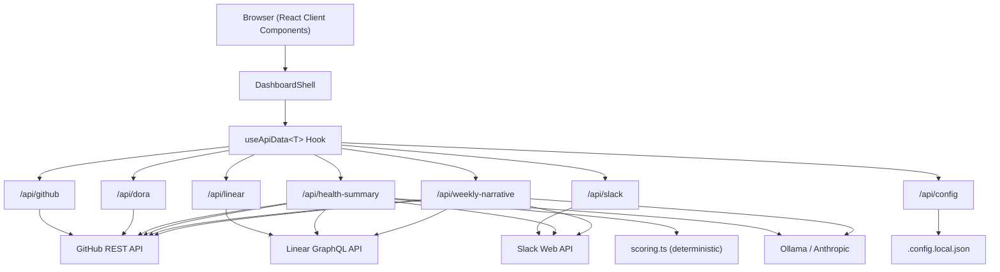
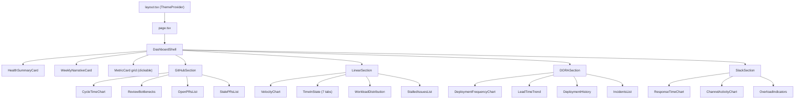

# Architecture

> Last updated: 2026-03-21. Update this document when making structural changes.

## Overview

Team Health Dashboard is a Next.js 16 application that aggregates engineering metrics from GitHub, Linear, and Slack, computes a deterministic health score, and optionally generates AI-powered narrative insights. It has no database — all data is fetched on-demand from source APIs on every request.

### Tech Stack

- **Next.js 16** (App Router) + **TypeScript** + **React 19**
- **Tailwind CSS** with class-based dark/light mode
- **Recharts 3** for charts
- **Octokit** for GitHub REST API (paginated with early termination)
- **Raw GraphQL fetch** for Linear API (no SDK)
- **@slack/web-api** for Slack API
- **Anthropic SDK** or **Ollama** for AI analysis

---

## System Architecture



### Request Flow

1. **Browser** renders `DashboardShell`, which mounts each section component
2. Each section calls `useApiData<T>(url, refreshKey)` to fetch its data
3. **API routes** call external APIs, compute metrics, and return structured JSON
4. **Health summary** aggregates all sources, computes a deterministic score, then passes data + score to the LLM for narrative insights
5. **Weekly narrative** sends all trend data to the LLM for a prose summary
6. Components render charts, tables, and cards from the typed response data

---

## Directory Structure

```
src/
├── app/
│   ├── page.tsx                        # Renders DashboardShell
│   ├── layout.tsx                      # Root layout, ThemeProvider
│   ├── globals.css                     # Tailwind + dark/light CSS variables
│   └── api/
│       ├── github/route.ts             # PR metrics
│       ├── linear/route.ts             # Sprint/cycle metrics
│       ├── slack/route.ts              # Communication metrics
│       ├── dora/route.ts               # DORA metrics
│       ├── health-summary/route.ts     # Score + AI insights
│       ├── weekly-narrative/route.ts   # AI prose narrative
│       └── config/route.ts             # Settings read/write
├── components/
│   ├── ThemeProvider.tsx                # Dark/light mode context
│   ├── dashboard/                      # Shell, health card, narrative, metric cards, settings
│   ├── github/                         # PR charts, review bottlenecks, stale/open lists
│   ├── linear/                         # Velocity, workload, time-in-state (7 tabs), stalled
│   ├── dora/                           # Deploy frequency, lead time, incidents, history
│   ├── slack/                          # Response time, channel activity, overload
│   └── ui/                             # Card, Badge, Skeleton, Spinner, ErrorState, RateLimitState, SectionHeader
├── hooks/
│   └── useApiData.ts                   # Generic fetch hook (all sections use this)
├── lib/
│   ├── github.ts                       # Octokit wrapper, paginated PR fetching
│   ├── linear.ts                       # Linear GraphQL client
│   ├── slack.ts                        # Slack Web API wrapper
│   ├── dora.ts                         # DORA metrics: deployments, incidents, correlation
│   ├── claude.ts                       # AI provider abstraction + prompt builders
│   ├── scoring.ts                      # Deterministic health score computation
│   ├── config.ts                       # Dual config reader (env vars + JSON file)
│   ├── utils.ts                        # Date helpers, rate limit error handling
│   └── __tests__/                      # Vitest unit tests
└── types/
    ├── api.ts                          # ApiResponse<T> envelope
    ├── github.ts, linear.ts, slack.ts  # Domain types
    ├── dora.ts                         # DORA types
    └── metrics.ts                      # Health score + narrative types
```

---

## Data Flow

### useApiData Hook

Every section uses the same generic hook:

```typescript
const { data, loading, refreshing, error, notConfigured, setupHint,
        fetchedAt, rateLimited, rateLimitReset, refetch } = useApiData<T>(url, refreshKey);
```

The hook returns a **standardized envelope** (`ApiResponse<T>`) that enables consistent handling across all sections:

- `notConfigured` — env vars missing, show setup placeholder
- `setupHint` — configured but unreachable (e.g., Ollama not running)
- `rateLimited` — API rate limit hit, show countdown to reset
- `refreshing` — refetching with stale data visible (no skeleton flash)
- `fetchedAt` — ISO timestamp for data freshness display

### Refresh Mechanism

```
RefreshButton (header) → increments refreshKey
  → DashboardShell passes refreshKey to all sections
    → useApiData re-fetches when refreshKey changes
```

Per-section refresh buttons also exist on GitHub, Linear, Slack, and DORA sections, allowing individual section refetches without reloading everything.

### API Response Envelope

All API routes return `ApiResponse<T>`:

```typescript
interface ApiResponse<T> {
  data?: T;
  error?: string;
  fetchedAt?: string;        // ISO timestamp
  notConfigured?: boolean;
  setupHint?: string;
  rateLimited?: boolean;
  rateLimitReset?: string;   // ISO timestamp when limit resets
}
```

---

## Health Scoring System

The health score is **deterministic** — same data always produces the same score. It does not rely on the LLM.

### Algorithm

1. Start at 100
2. Each connected integration contributes deductions based on signal thresholds
3. Rescale: `score = 100 - (totalDeductions / maxPossibleDeductions) * 100`
4. Only score against connected integrations (disconnected ones don't penalize)

### Deduction Categories

| Category | Max Points | Signals |
|----------|-----------|---------|
| **GitHub** | 30 | Cycle time (8), stale PRs (8), review queue (7), cycle time trend (7) |
| **Linear** | 30 | Stalled issues (6), workload imbalance (6), velocity trend (6), flow efficiency (4), WIP per person (4), long-running items (4) |
| **Slack** | 20 | Response time (8), overloaded members (6), response time trend (6) |
| **DORA** | 20 | Deploy frequency (5), lead time (5), change failure rate (5), MTTR (5) |

### Health Bands

| Score | Band |
|-------|------|
| 80-100 | Healthy |
| 60-79 | Warning |
| 0-59 | Critical |

### Scoring File

`src/lib/scoring.ts` — exports `computeHealthScore(github, linear, slack, dora)`. Each parameter is nullable; only connected sources contribute deductions. The DORA score only activates when `totalDeployments > 0`.

---

## DORA Metrics

### Data Sources (auto-detected fallback chain)

1. **GitHub Deployments API** — checks for deployment records + statuses
2. **GitHub Releases API** — fallback if no deployments found
3. **Merged PRs to default branch** — fallback if no releases found

Can be explicitly set via `DORA_DEPLOYMENT_SOURCE` config.

### Four Key Metrics

| Metric | How It's Computed | Rating Benchmarks |
|--------|-------------------|-------------------|
| **Deployment Frequency** | Deployments per week | Elite: daily+, High: weekly, Medium: monthly, Low: <monthly |
| **Lead Time for Changes** | First commit → deploy (or PR created → merged) | Elite: <1h, High: <24h, Medium: <168h, Low: >168h |
| **Change Failure Rate** | % of deployments causing incidents | Elite: <5%, High: <10%, Medium: <15%, Low: >15% |
| **MTTR** | Avg hours from incident open → close | Elite: <1h, High: <24h, Medium: <168h, Low: >168h |

### Incident Detection

Incidents are identified from two sources:
1. **Labeled GitHub issues** — issues matching configured labels (default: `incident`, `hotfix`, `production-bug`)
2. **Reverted PRs** — merged PRs whose title starts with "Revert"

Incidents are correlated to deployments via a **24-hour time proximity window**.

### Code

`src/lib/dora.ts` — exports `fetchDORAMetrics(owner, repo, lookbackDays, options)`. Internally calls `fetchDeployments()`, `fetchReleases()`, `fetchIncidents()`, `correlateIncidents()`, `computeSummary()`, `computeTrend()`.

---

## AI Integration

### Two Providers

| Provider | Config | Notes |
|----------|--------|-------|
| **Ollama** (default) | `AI_PROVIDER=ollama` | Free, local. Requires `ollama pull llama3`. |
| **Anthropic** | `ANTHROPIC_API_KEY=...` | Paid. Uses Claude Sonnet. |

Auto-detected: if `ANTHROPIC_API_KEY` is set, uses Anthropic. Otherwise defaults to Ollama.

### Two AI Endpoints

1. **Health Summary** (`/api/health-summary`):
   - Computes deterministic score first (no LLM)
   - Passes score + raw data to LLM for insights and recommendations only
   - Falls back to score breakdown as insights if LLM fails
   - Uses JSON mode + temperature 0 for structured output

2. **Weekly Narrative** (`/api/weekly-narrative`):
   - Sends all trend data to LLM for prose summary
   - Post-processes to strip hallucinated references to disconnected sources

### Graceful Degradation

- If AI is unconfigured → health score still works (deterministic), narrative shows setup hint
- If AI fails → health score works, error shown for narrative
- If some integrations are missing → AI only receives data from connected sources

### Code

`src/lib/claude.ts` — exports `generateHealthSummary()`, `generateWeeklyNarrative()`, `isAIConfigured()`. Contains prompt builders, JSON extraction, and hallucination stripping.

---

## Configuration System

### Dual Config with Precedence

```
process.env (via .env.local)  →  takes precedence
  ↓ fallback
.config.local.json (via Settings UI)
```

### Settings UI

Gear icon → modal with sidebar navigation (GitHub, Linear, Slack, DORA, AI sections). Each field has a `?` help popover with step-by-step instructions. Saves to `.config.local.json` (gitignored).

### Config API

- `GET /api/config` — returns which integrations are configured (booleans, no secrets)
- `POST /api/config` — saves values to `.config.local.json` (whitelisted keys only)

### Code

`src/lib/config.ts` — exports `getConfig(key)`, `saveConfig(values)`, `getConfigStatus()`, `clearConfigCache()`.

---

## Caching Layer

### Architecture

Server-side in-memory cache with interface-based design for swappable backends.

- **`src/lib/cache.ts`** — `CacheStore` interface, `InMemoryCacheStore` (Map-backed), `getOrFetch<T>()` helper, `buildCacheKey()`, TTL constants
- **Pattern**: `getOrFetch(key, ttl, fetcher, { force? })` — returns cached value if fresh, calls fetcher if stale, serves expired cache on error (stale-on-error)
- **Cache keys**: deterministic, parameter-aware (e.g., `github:lookbackDays=30:staleDays=7`)

### TTLs

| Source | TTL | Rationale |
|--------|-----|-----------|
| GitHub, Linear, Slack, DORA | 5 min | Data routes — balance freshness vs API load |
| Health Summary | 10 min | Includes LLM call |
| Weekly Narrative | 15 min | Expensive LLM generation |

### Key behaviors

- **Force refresh**: Refresh button appends `?force=true`, bypassing cache
- **Stale-on-error**: Rate limit or network failure serves expired cache if available
- **Config invalidation**: `POST /api/config` calls `cache.clear()` — new config means stale cache
- **Auto-cleanup**: Entries removed at 2x TTL to prevent memory growth
- **UI indicator**: Sections show "(cached)" in amber next to timestamp when serving cached data

### Swapping backends

Implement the `CacheStore` interface (`get`, `set`, `delete`, `clear`) with a different backing store (filesystem, Redis, SQLite). Replace the singleton export in `cache.ts`.

---

## Frontend Architecture

### Component Hierarchy



### Key UI Patterns

- **Clickable metric cards** — summary cards scroll to their corresponding detail views via anchor IDs
- **Pill-style button controls** — all selectors use button groups, not native `<select>` (avoids React 19 hydration mismatches)
- **Deferred slider commits** — sliders use separate visual and committed state to avoid API calls on every drag
- **Stale-while-revalidate** — during refetch, existing data stays visible with a pulsing animation
- **Per-section refresh** — each section has its own refresh button; hidden during rate limit states

### Theme System

`ThemeProvider.tsx` — React context with `useTheme()` hook. Reads/writes `localStorage`. Defaults to dark mode. Toggles the `dark` class on `<html>`. Light mode is labeled "Incorrect Mode" in the UI.

---

## Testing & CI

### Tests

- **Framework**: Vitest
- **Location**: `src/lib/__tests__/`
- **Coverage**: `scoring.ts` (health score computation with mock data builders) and `utils.ts` (date helpers)
- **Run**: `npm test` (single pass) or `npm run test:watch` (continuous)

### CI Pipeline

`.github/workflows/ci.yml` — runs on push to `main` and pull requests:

1. Checkout → Setup Node 20 → `npm ci` → `npm test` → `npm run build`

---

## Rate Limit Handling

GitHub API rate limits are detected and surfaced:

1. **Octokit** throws on 403 rate limit responses (retry plugin disabled for rate limits)
2. **API routes** catch rate limit errors, return `{ rateLimited: true, rateLimitReset }` with 429 status
3. **useApiData** detects `rateLimited` in response, sets state
4. **RateLimitState component** shows amber clock icon with countdown to reset time
5. **Per-section refresh buttons** are hidden during rate limit state

Rate limit detection is implemented for GitHub and DORA sections. Linear and Slack rate limiting is not yet handled.

---

## Known Constraints

- GitHub PR pagination caps at 500 PRs; review data fetched for up to 50 PRs
- Recharts Tooltip `formatter` must use `(value) => [...]` without explicit parameter types (type incompatibility)
- Recharts `activeLabel` requires `String()` cast; `ResponsiveContainer` needs explicit pixel heights and `minWidth={0}`
- React hooks must be called before any conditional early returns (Rules of Hooks)
- Local LLMs (Ollama) frequently ignore prompt instructions — compensated with JSON mode, temperature 0, and post-processing
- Slack integration has not been verified with a live workspace
- Server-side in-memory cache (5min TTL for data routes, 10-15min for AI routes) — lost on restart, no cross-worker sharing
- No persistence — all data is ephemeral snapshots, no historical trending
